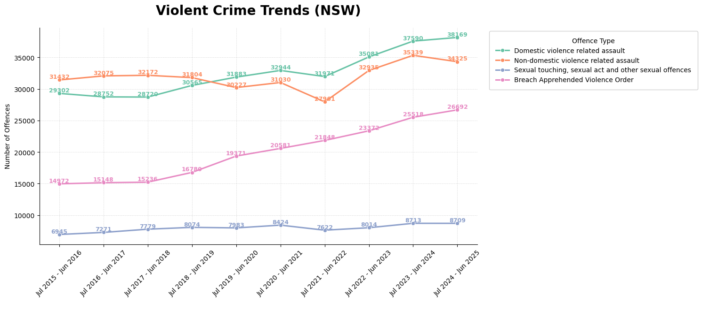
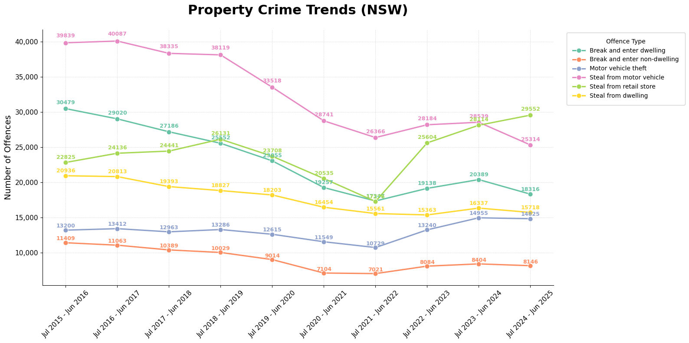
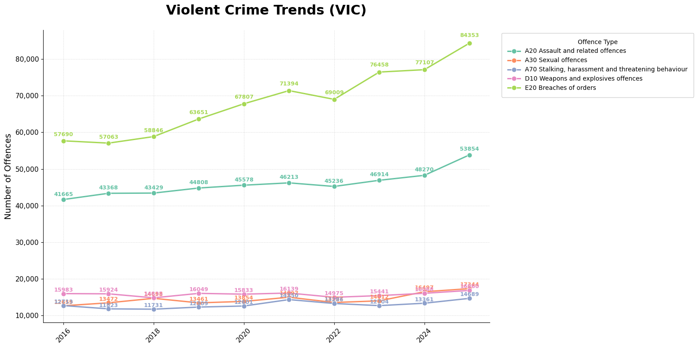
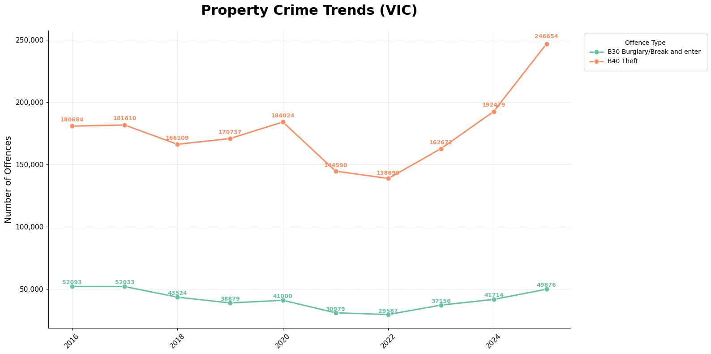
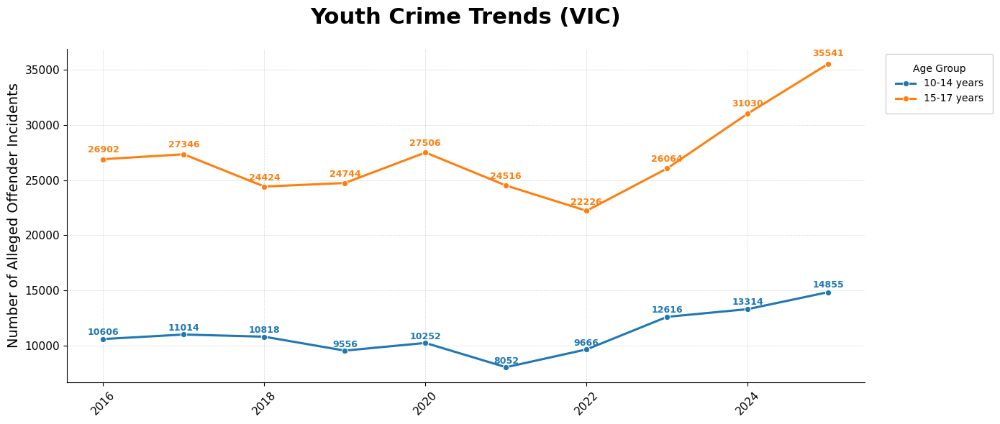
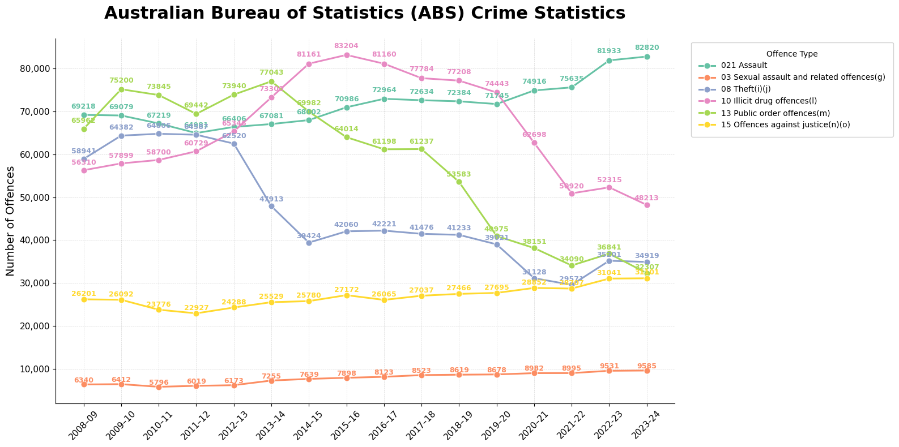

# Introduction
The following is an observation of crime trends across New South Wales, Victoria and Australia-wide. I previously worked as a research officer and found it fascinating to see crime trends over periods of time. This report is also in response to growing fears about 'rising crime' in Australia. 

## NSW Crime Trends 
NSW crime tends to receive intense media coverage, inflaming political and social discourse. I did not observe crime trends by Local Government Areas (LGA), but looked more wholistically. This is partly because regional NSW has a significant proportion of crime due to lower socioeconomic outcomes. Data was sourced from Bureau of Crime Statistics and Research (BOCSAR)

### Violent Crime
#### Code

 ``` python 
 offences_to_plot = ["Non-domestic violence related assault", "Domestic violence related assault", "Sexual touching, sexual act and other sexual offences", "Breach Apprehended Violence Order"]

plt.figure(figsize=(12,6))
ax = sns.lineplot(data=nsw_long[nsw_long["Offence type"].isin(offences_to_plot)],
             x="Year", y="Count", hue="Offence type", marker="o", palette= "Set2", linewidth = 2.2)

# Add numbers to each marker
for line, offence in zip(ax.lines, offences_to_plot):
    y = line.get_ydata()
    x = line.get_xdata()

    for xi, yi in zip(x, y):
        ax.text(
            xi,
            yi,
            f"{int(yi)}",        # the number
            fontsize=9,
            ha='center',
            va='bottom', 
            color=line.get_color(),
            fontweight="semibold"
        )

plt.title("Violent Crime Trends (NSW)", fontsize = 20, pad = 20, fontweight = "bold")
plt.xlabel(" ")
plt.ylabel("Number of Offences")
plt.xticks(rotation=45)
plt.grid(True, linestyle="--", linewidth=0.5, alpha=0.5)
plt.legend(
    title="Offence Type",
    bbox_to_anchor=(1.02, 1),
    loc="upper left",
    frameon=True,
    framealpha=0.9,
    borderpad=1
)

sns.despine(top= True, right= True)
plt.show()
```

#### Visualisation
 

 - Violent crime has generally increased over the past 10 years. 
 
 - Despite this, it is important to note that breaches of orders and domestic violence related crime has increased due to increased police attention. 

 - Police are now more proactive in issuing orders of protections. Furthermore, NSW Police have emphasised a greater focus on domestic violence. Operations such as Amarok are a direct result of these efforts and are focused on proactive policing of domestic violence offenders. 

 - Sexual Assault has remained relatively stable. This is an area of importance as it highlights that current efforts are likely not working. 

 - Proactive policing, greater efficiency in reporting and follow-ups and education at a younger age may reduce sexual assaults in NSW. 

### Property Crime 
#### Code 
``` python 
offences_to_plot = [
    "Break and enter dwelling",
    "Break and enter non-dwelling",
    "Steal from motor vehicle",
    "Motor vehicle theft",
    "Steal from dwelling",
    "Steal from retail store"
]

plt.figure(figsize=(16, 8))
ax = sns.lineplot(
    data=nsw_long[nsw_long["Offence type"].isin(offences_to_plot)],
    x="Year", y="Count",
    hue="Offence type",
    marker="o",
    linewidth=2.2,
    markersize=8,
    palette="Set2"
)

# Add numbers to markers (offset so they don't touch the point)
for line in ax.lines:
    y = line.get_ydata()
    x = line.get_xdata()

    for xi, yi in zip(x, y):
        ax.text(
            xi,
            yi + (yi * 0.015),  # slight vertical offset (1.5%)
            f"{int(yi)}",
            fontsize=9,
            ha="center",
            va="bottom",
            color=line.get_color(),
            fontweight="semibold"
        )

# Title + labels
plt.title(
    "Property Crime Trends (NSW)",
    fontsize=22,
    pad=25,
    fontweight="bold"
)

plt.xlabel("")
plt.ylabel("Number of Offences", fontsize=14)

plt.xticks(rotation=45, fontsize=11)
plt.yticks(fontsize=11)

# Soft grid
plt.grid(True, linestyle="--", linewidth=0.5, alpha=0.5)

# Legend moved outside right
plt.legend(
    title="Offence Type",
    bbox_to_anchor=(1.02, 1),
    loc="upper left",
    frameon=True,
    framealpha=0.9,
    borderpad=1
)
ax.yaxis.set_major_formatter(mtick.StrMethodFormatter("{x:,.0f}"))  # adds commas
sns.despine(top=True, right=True)
plt.tight_layout()
plt.show()
```

####  Visualisation

- Property crime in NSW has generally trended downwards over the past 10 years. Proactive policing and increased operations such as Sweetenham and Mongoose have been successful in reducing reoffending, which deflates the overall statistics. 

- Despite the overall downward trends in property crime, steal from retail and motor vehicle theft have increased over the past 10 years. 

- Steal from retail rose sharply after the COVID-19 pandemic. Increased cost-of-living in NSW has dramatically increased the cost of everyday items such as food and utilities. The cost-of-living crisis combined with increased surveillance through cameras has likely led to a dramatic increase in steal from retail offences. 

- Motor vehicle theft has been the subject of wide media coverage in NSW. It is likely motor vehicle theft is driven by either joy-riding or opporunistic crime. It is enabled by the continual posting of vehicle thefts in online spaces by youth. A particular emerging trend is the use of youths to steal vehicles on behalf of organised crime figures, which not only affects policing but can also entrench youth in the criminal justice system. 


# Victoria Crime Trends 

Recent media coverage has focused on the 'alarming' rate of crime in Victoria. These reports often lead to a loss in social cohesion and political backlash. I wanted to observe how much truth there is to these claims and the overall trends in crime in Victoria. Data was sourced from the Crime Statistics Agency.

### Violent Crime
####  Code

``` python 
offences_vic = [
    "A20 Assault and related offences",
    "A30 Sexual offences",
    "A70 Stalking, harassment and threatening behaviour",
    "D10 Weapons and explosives offences", 
    "E20 Breaches of orders"
]

plt.figure(figsize=(16, 8))
ax = sns.lineplot(
    data= vic_crime_data_long[vic_crime_data_long["Offence Subdivision"].isin(offences_vic)],
    x="Year", y="Count",
    hue="Offence Subdivision",
    marker="o",
    linewidth=2.2,
    markersize=8,
    palette="Set2"
)

# Add numbers to markers (offset so they don't touch the point)
for line in ax.lines:
    y = line.get_ydata()
    x = line.get_xdata()

    for xi, yi in zip(x, y):
        ax.text(
            xi,
            yi + (yi * 0.015),  # slight vertical offset (1.5%)
            f"{int(yi)}",
            fontsize=9,
            ha="center",
            va="bottom",
            color=line.get_color(),
            fontweight="semibold"
        )

# Title + labels
plt.title(
    "Violent Crime Trends (VIC)",
    fontsize=22,
    pad=25,
    fontweight="bold"
)

plt.xlabel("")
plt.ylabel("Number of Offences", fontsize=14)

plt.xticks(rotation=45, fontsize=11)
plt.yticks(fontsize=11)

# Soft grid
plt.grid(True, linestyle="--", linewidth=0.5, alpha=0.5)

# Legend moved outside right
plt.legend(
    title="Offence Type",
    bbox_to_anchor=(1.02, 1),
    loc="upper left",
    frameon=True,
    framealpha=0.9,
    borderpad=1
)
ax.yaxis.set_major_formatter(mtick.StrMethodFormatter("{x:,.0f}"))  # adds commas
sns.despine(top=True, right=True)
plt.tight_layout()
plt.show()
```

#### Visualisation 


- Similar to NSW, breaches of orders dominate crime trends in Victoria. These orders are utilised to keep victims safe and proactively police offenders. 

- Sexual offences have remained stable. Despite this, it is key to address certain inadequacies in the justice system that may allow offenders to escape charges. Strengthening reporting and follow-through by police is key to reducing sexual assault offences. 


### Property Crime

#### Code 
``` python 
offences_vic2 = [
    "B30 Burglary/Break and enter",
    "B40 Theft",
]

plt.figure(figsize=(16, 8))
ax = sns.lineplot(
    data= vic_crime_data_long[vic_crime_data_long["Offence Subdivision"].isin(offences_vic2)],
    x="Year", y="Count",
    hue="Offence Subdivision",
    marker="o",
    linewidth=2.2,
    markersize=8,
    palette="Set2"
)

# Add numbers to markers (offset so they don't touch the point)
for line in ax.lines:
    y = line.get_ydata()
    x = line.get_xdata()

    for xi, yi in zip(x, y):
        ax.text(
            xi,
            yi + (yi * 0.015),  # slight vertical offset (1.5%)
            f"{int(yi)}",
            fontsize=9,
            ha="center",
            va="bottom",
            color=line.get_color(),
            fontweight="semibold"
        )

# Title + labels
plt.title(
    "Property Crime Trends (VIC)",
    fontsize=22,
    pad=25,
    fontweight="bold"
)

plt.xlabel("")
plt.ylabel("Number of Offences", fontsize=14)

plt.xticks(rotation=45, fontsize=11)
plt.yticks(fontsize=11)

# Soft grid
plt.grid(True, linestyle="--", linewidth=0.5, alpha=0.5)

# Legend moved outside right
plt.legend(
    title="Offence Type",
    bbox_to_anchor=(1.02, 1),
    loc="upper left",
    frameon=True,
    framealpha=0.9,
    borderpad=1
)
ax.yaxis.set_major_formatter(mtick.StrMethodFormatter("{x:,.0f}"))  # adds commas
sns.despine(top=True, right=True)
plt.tight_layout()
plt.show()
```

#### Visualisation 

- Theft included vehicle thefts, steal from retail and steal from residences. In Victoria, theft has risen dramatically, especially after the COVID-19 Pandemic. 

- It is likely this dramatic increase is due to higher cost-of-living which is straining incomes of households. 

- Some of these statistics may be a reflection of youth stealing vehicles. This subsection of crime is likely due to the emergence of joyriding as a method to gain social media fame and glory. 

### Youth Crime 
Youth crime in Victoria has garnered significant media backlash. Thus I wanted to explore what the overall trend was of youth offending. 

#### Code 

``` python 
plt.figure(figsize=(14,6))
ax = sns.lineplot(
    data=youth_grouped,
    x='Year',
    y='Alleged Offender Incidents',
    hue='Age Group',
    marker='o', 
    linewidth = 2.2
)

# Add numbers to markers (offset so they don't touch the point)
for line in ax.lines:
    y = line.get_ydata()
    x = line.get_xdata()

    for xi, yi in zip(x, y):
        ax.text(
            xi,
            yi + (yi * 0.015),  # slight vertical offset (1.5%)
            f"{int(yi)}",
            fontsize=9,
            ha="center",
            va="bottom",
            color=line.get_color(),
            fontweight="semibold"
        )

# Title + labels
plt.title(
    "Youth Crime Trends (VIC)",
    fontsize=22,
    pad=25,
    fontweight="bold"
)

plt.xlabel("")
plt.ylabel("Number of Alleged Offender Incidents", fontsize=14)

plt.xticks(rotation=45, fontsize=11)
plt.yticks(fontsize=11)

# Soft grid
plt.grid(True, linestyle="--", linewidth=0.5, alpha=0.5)

# Legend moved outside right
plt.legend(
    title="Age Group",
    bbox_to_anchor=(1.02, 1),
    loc="upper left",
    frameon=True,
    framealpha=0.9,
    borderpad=1
)

sns.despine(top=True, right=True)

plt.tight_layout()
plt.show()
```
#### Visualisation 

- Youth crime has increased, however, I did not group the ages together and thus this may skew the data. 

- Alarmingly, 10-14 year olds are increasingly being identified as offenders. This has large ramifications for the minimum age of criminal responsiblity in Victoria, which is currently 12 but has been discussed to increase to 14. Continuation of this trend will likely call into question current Police practices and the validity of the minimum age of criminal responsiblity. 

- 15-17 year olds dominate youth crime trends, highlighted by the overall increase of offenders in this age bracket over the past 10 years. 

- It is likely that 15-17 year olds are undergoing significant biological changes that may increase aggression and novelty-seeking behaviours in some youths. This relationship is mediated by several socioeconomic factors such as poverty and previous victimisation.

- Early intervention is key to reduce the likelihood 10-14 year old offenders continuing to offend into their adolescence. This can be achieved through cohesive programs that target the root causes of youth crime such as socioeconomic deficits and a lack of education (among many others).


# Australia-Wide 

The Australian Bureau of Statistics (ABS) produces reports on crime statistics. I utilised these statistics to observe Australia-wide crime trends. 

#### Code 
``` python 
measures = [ "02 Acts intended to cause injury(f)", "03 Sexual assault and related offences(g)", "13 Public order offences(m)", "08 Theft(i)(j)", "021 Assault", "10 Illicit drug offences(l)", "15 Offences against justice(n)(o)"]

plt.figure(figsize=(16, 8))
ax = sns.lineplot(
    data= df_long[df_long['Principal offence(b)(c) '].isin(measures)],
    x="Year", y="Count",
    hue='Principal offence(b)(c) ',
    marker="o",
    linewidth=2.2,
    markersize=8,
    palette="Set2"
)

# Add numbers to markers (offset so they don't touch the point)
for line in ax.lines:
    y = line.get_ydata()
    x = line.get_xdata()

    for xi, yi in zip(x, y):
        ax.text(
            xi,
            yi + (yi * 0.015),  # slight vertical offset (1.5%)
            f"{int(yi)}",
            fontsize=9,
            ha="center",
            va="bottom",
            color=line.get_color(),
            fontweight="semibold"
        )

# Title + labels
plt.title(
    "Australian Bureau of Statistics (ABS) Crime Statistics",
    fontsize=22,
    pad=25,
    fontweight="bold"
)

plt.xlabel("")
plt.ylabel("Number of Offences", fontsize=14)

plt.xticks(rotation=45, fontsize=11)
plt.yticks(fontsize=11)

# Soft grid
plt.grid(True, linestyle="--", linewidth=0.5, alpha=0.5)

# Legend moved outside right
plt.legend(
    title="Offence Type",
    bbox_to_anchor=(1.02, 1),
    loc="upper left",
    frameon=True,
    framealpha=0.9,
    borderpad=1
)
ax.yaxis.set_major_formatter(mtick.StrMethodFormatter("{x:,.0f}"))  # adds commas
sns.despine(top=True, right=True)
plt.tight_layout()
plt.show()
```
#### Visualisation 


- Overall crime in Australia has reduced in several categories of interest. This is a positive reflection of ongoing Government efforts in reducing crime through policing and the delivery of greater socioeconomic outcomes for communities. 

- Assault has increased, however, this is likely due to increased reporting to police and other judicial bodies. Orders such as Apprenhended Violence Orders (AVOs) are primarily used to reduce the likelihood of repeat offending. Despite this, there is little empirical evidence to suggest it is effective. 


# Conclusion
Crime in NSW and Victoria has generally reduced over the past 10 years. This is due to greater policing efforts and positive increases in socioeconomic conditions across both states. 

Youth crime, property crime, domestic violence and sexual assault are key areas of improvement that must be addressed by both Police and other Government bodies. These crime subcategories are dominating headlines which can adversely affect police response. It is imperative interventions, diversions and efficient reporting channels are utilised to assist victims and reduce the overall number of offenders. 
